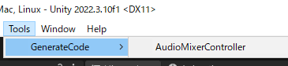
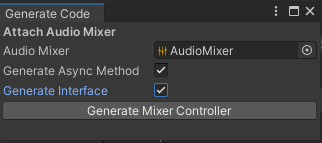

# なんの記事？
AudioMixerは非常に便利な機能ですが、

スクリプトから各機能にアクセスするためには、exposed parametersを作成し、

文字列でそれを読み取って制御しなければなりません。

せっかく柔軟な音声コントロールを提供しているのに、

文字列が増えたり減ったりする度にスクリプト編集が必要になると 柔軟性を活かしきれません。

そこで、自動でコントローラークラスを生成してくれるエディタ拡張を作りました！

# 導入方法

* 以下URL右側のReleaseページから unitypackage　をDLして使ってください。

https://github.com/amenonegames/AudioMixerControllerGenerator

# 利用方法

## 起動

メニューバーのTools>GenerateCode>AudioMixerControllerから起動します。



起動すると以下のようなウインドウが表示されます。

AudioMixerをアタッチして、ボタンを押すと、設定位置にコードが自動生成されます！



初期設定では、Controllerは```Assets/Scripts/Sound/AudioMixerController.cs```として生成されます。

また、interfaceは``Assets/Scripts/Sound/Interface/IAudioMixerControllable.cs``として生成されます。

::: note alert

標準設定のAsyncメソッド生成は、DotweenとUniTaskに依存しています。

標準設定のままAsyncメソッドを利用したい場合には、各パッケージを導入しておいてください。

:::

## 実装メソッド

実装メソッドを以下に紹介します。

自動生成されるenumを指定して使える共通メソッドが2種類、
Asyncメソッドを要求した場合は、追加でさらに2種類生成されます。

### ExposedPropertyChange(float value ,ExposedProperty prop)

指定のExposedPropertyの値を変更します。

ExposedPropertyは自動実装されたenumで指定可能です。

### ExposedPropertyReset(float value ,ExposedProperty prop)

指定のExposedPropertyの値を起動時の値に戻します。

ExposedPropertyは自動実装されたenumで指定可能です。

### ExposedPropertyChangeAsync(float value, CancellationToken token, float duration ,ExposedProperty prop)

指定のExposedPropertyの値をduration分の時間をかけて変更します。

ExposedPropertyは自動実装されたenumで指定可能です。

::: note alert

標準設定のAsyncメソッド生成は、DotweenとUniTaskに依存しています。

:::

### ExposedPropertyResetAsync(CancellationToken token, float duration ,ExposedProperty prop)

指定のExposedPropertyの値を、duration分の時間をかけて元の値に戻します。

ExposedPropertyは自動実装されたenumで指定可能です。

::: note alert

標準設定のAsyncメソッド生成は、DotweenとUniTaskに依存しています。

:::

::: note info

この他にも、各ExposedPropertyの値を変更するメソッドが自動生成されます。

詳細は生成されたコードを参照してください。

:::

# 生成コードの設定変更

生成コードの設定は以下ファイルを書き換えることで変更可能です。

Assets/Plugins/GenerateAudioMixerController/Editor/
AudioMixerControllerGenerationSetting.cs

コードを見ていただいた方が良いかと思いますが、

各設定項目の解説も掲載します。コードと併せて確認してください。

### requireOverrideFiles
同名ファイルが既にある場合に上書きするかを指定します。

同名クラスが重複するとエラーになるので、true にして常に上書きする運用を推奨します。

### isMonoBehaviourAndSerializeAudioMixer
ControllerクラスをMonoBehaviourとして実装するかを指定します。

falseの場合にはピュアクラスとして生成し、コンストラクタ引数でAudioMixerを受け取ります。

### GenerateClassImportNameSpace()
Controllerクラスにusingステートメントで宣言するNameフィールドを指定します。

AsyncMethodの生成が要求された場合、以下の箇所でDotWeenとUniTask関連のusingステートメントが生成される設定になっています。

他の方法でAsyncメソッドを実装する場合は書き換えてください。

```csharp
            if (requireAsyncMethod) 
                classImportNameSpace += @$"
using System.Threading;
using Cysharp.Threading.Tasks;
using DG.Tweening;
";
```

また、interface の実装が要求されており、
interfaceのネームスペースが切られている場合は以下の箇所で自動的にusing宣言します。

```csharp
            if (requireInterfaceGeneration && !string.IsNullOrEmpty(interfaceNameSpace)) 
                classImportNameSpace += @$"
using {interfaceNameSpace};";
```

### classNameSpace
Controllerクラスを配置するNamespaceを指定します。

### className
Controllerクラスのクラス名を指定します。

### GenerateClassFilePath()
Controllerクラスを保存するファイルパスを指定します。

{className}部分に、上記のclassNameの値が置換されます。

### additionalClasVariableDeclaration
Controllerクラスのメンバ変数として追加で宣言したいことがあれば記入します。

### GenerateChangeMethodName(string propertyName)
ExposedPropertyの値を変更するメソッド名を指定します。Interfaceの生成に利用されます。

引数のpropertyNameには、ExposedPropertyの名前が渡されます。

### GenerateChangeMethodCall(string propertyName)

ExposedPropertyの値を変更するメソッドをコールする記載を指定します。

共通メソッドであるExposedPropertyChangeｎの生成に利用されます。

引数のpropertyNameには、ExposedPropertyの名前が渡されます。

### GenerateChangeMethod(string propertyName)

個別のExposedPropertyの値を変更するメソッドの実装を指定します。

引数のpropertyNameには、ExposedPropertyの名前が渡されます。

### GenerateResetMethodName(string propertyName)

ExposedPropertyの値をリセットするメソッド名を指定します。Interfaceの生成に利用されます。

引数のpropertyNameには、ExposedPropertyの名前が渡されます。

### GenerateResetMethodCall(string propertyName)

ExposedPropertyの値をリセットするメソッドをコールする記載を指定します。

共通メソッドであるExposedPropertyResetの生成に利用されます。

引数のpropertyNameには、ExposedPropertyの名前が渡されます。

### GenerateResetMethod(string propertyName)

個別のExposedPropertyの値をリセットするメソッドの実装を指定します。

引数のpropertyNameには、ExposedPropertyの名前が渡されます。

### GenerateChangeAsyncMethodName(string propertyName)

GenerateChangeMethodNameと同様ですが、Asyncメソッド用です。

### GenerateChangeAsyncMethodCall(string propertyName)

GenerateChangeMethodCallと同様ですが、Asyncメソッド用です。

### GenerateChangeAsyncMethod(string propertyName)

GenerateChangeMethodと同様ですが、Asyncメソッド用です。

### GenerateResetAsyncMethodName(string propertyName)

GenerateResetMethodNameと同様ですが、Asyncメソッド用です。

### GenerateResetAsyncMethodCall(string propertyName)

GenerateResetMethodCallと同様ですが、Asyncメソッド用です。

### GenerateResetAsyncMethod(string propertyName)

GenerateResetMethodと同様ですが、Asyncメソッド用です。

### GenerateInterfaceImportNameSpace()

Interfaceのusingステートメントを指定します。

利用するEnumがクラスと同じNamespaceに存在するため、クラスのネームスペースもusingします。

### interfaceNameSpace

InterfaceのNamespaceを指定します。

### interfaceName

Interfaceの名前を指定します。

### GenerateInterfaceFilePath()
Interfaceを保存するファイルパスを指定します。

{interfaceName}部分に、上記のinterfaceNameの値が置換されます。

### requireAsyncMethod
Asyncメソッドを生成するかを指定します。
エディタ上のチェックボックスよって値が上書きされるため、コードからは変更できません。

### requireInterfaceGeneration
Interfaceを生成するかを指定します。
エディタ上のチェックボックスよって値が上書きされるため、コードからは変更できません。
